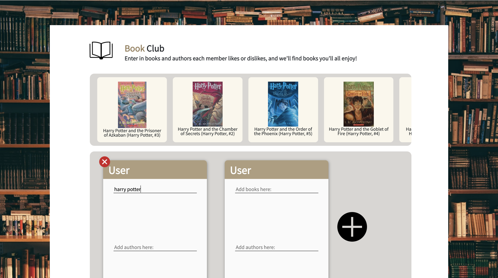

# BookClub 

BookClub is a web app that gives ad-hoc book recommendation for a book club. It takes in inputted preferences of books, authors and genres of each club member, and then the system gives a comprehensive recommendation based on all the inputted factors and ratings. This project is the final project to CS 4300: Language & Information.

## Demo
Here is a working live demo :  http://bookclub-4300.herokuapp.com

## Built with 

- **Front-end pages:** HTML, CSS, JavaScript, jQuery

-  **Back-end server:** Flask (Python)

  

## IR System

We used tokenization and stemming of Goodreads book reviews to create TF-IDF vectors representing books, and we stacked these vectors together to form a term-document matrix. Initially, we transformed this term-document matrix into an inverted index to use for computing cosine similarity. However, then we used SVD to reduce the term-document matrix, and that made the book vector representations dense enough that using the inverted index was no longer faster than using numpy matrix multiplication. To score similarity, we combined the vector representations of the user inputs to form a query vector, and computed cosine similarity between that query vector and every book in our dataset to find the most similar results. We also do query expansion: we update the query vectors with a list of similar works (provided by the Goodreads dataset we used), using a procedure inspired by the Rocchio algorithm.

Goodreads dataset by UCSD: https://sites.google.com/eng.ucsd.edu/ucsdbookgraph/home?authuser=0

## Social Component

User-provided reviews will be used to generate similarity scores between books, and between each free-form keyword and book. In addition, we may use other user book interactions (i.e. saving a book to a ‘shelf’) to further inform our similarity rankings. We will primarily look at user reviews and interactions, and not manuscripts, as we believe user interaction will be a greater indicator of similarity than the actual text of the book, and will therefore inform higher quality recommendations. 

## Team Members

Caroline Lui (cel243), Janie Walter (jjw249), Elisabeth Finkel (esf76), Kurt Huebner (krh57), Taixiang (Max) Zeng (tz376)